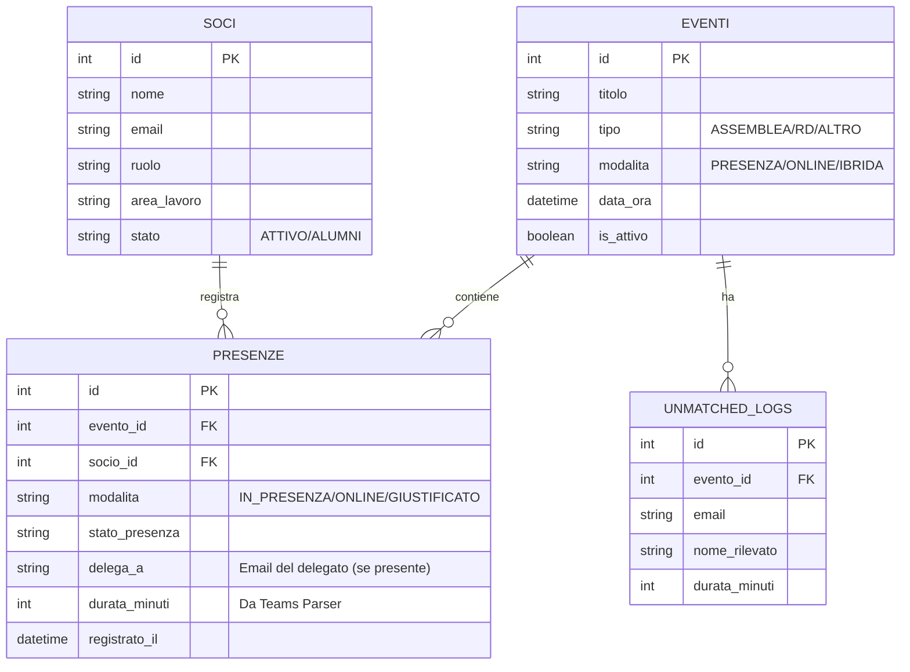

# Presente! - JEMORE Attendance Management System

Presente! è la piattaforma  progettata e sviluppata per la gestione delle presenze agli eventi associativi (Assemblee, Formazioni, Area Meeting, etc.), integrando i sistemi di autenticazione Microsoft 365 e automatizzando le procedure burocratiche.

---

## 📑 Table of Contents
1. [Project Overview & Features](#1-project-overview--features)
2. [Project Directory Structure](#2-project-directory-structure)
3. [Database Architecture & ER Diagram](#3-database-architecture--er-diagram)
4. [System Architecture & Workflows](#4-system-architecture--workflows)
5. [Authentication & Environment Configuration](#5-authentication--environment-configuration)
6. [Local Setup & Quickstart Guide](#6-local-setup--quickstart-guide)

---

## 1. Project Overview & Features

Presente! risolve le inefficienze legate al monitoraggio delle presenze attraverso un approccio ibrido che copre ogni possibile modalità di partecipazione, garantendo validità formale ai fini statutari.

### 🌟 Key Features:
* **Hybrid Check-in Support**: 
  * Sistema di check-in in presenza tramite **Dynamic QR Code** crittografato (anti-tampering) che via il dashboard.
* **Pre-Assembly Form Import**: Importazione massiva dei dati provenienti dai moduli Forms pre-assemblea. Il sistema riconosce e traccia automaticamente le **Deleghe** e le **Assenze Giustificate** preventivamente, aggiornando lo stato dei soci senza intervento manuale.
* **Global Absence Streak & Alert Engine**: Motore analitico che calcola in tempo reale il rischio di decadimento in conformità allo statuto.
  * **🔴 Critica (Red Alert)**: $\ge 2$ assenze *consecutive* in Assemblea.
  * **🟡 Alert (Yellow Alert)**: $\ge 1$ assenza in Assemblea (non consecutiva).
* **Role-Based Access Control (RBAC)**: Integrazione profonda con Azure Active Directory.
  * Check-in accessibile a chiunque possegga un account `@jemore.it`.
  * Dashboard Admin rigorosamente riservata ai membri del Board e Responsabili.
* **One-Click Minutes Export**: Esportazione istantanea in **PDF** e **CSV** del registro presenze ufficiale, già formattato per essere allegato come documento formale ai Verbali d'Assemblea.

---

## 2. Project Directory Structure

Il progetto segue un'architettura moderna disaccoppiata (Frontend in React/Next.js e Backend in Python/FastAPI), comunicando tramite API REST e Server-Sent Events (SSE).

```text
Presente!/
├── backend/                  # Python FastAPI Backend
│   ├── main.py               # Application entrypoint e definizione delle rotte API (REST & SSE).
│   ├── models.py             # Definizione dei modelli SQLAlchemy (Schema Database).
│   ├── database.py           # Connessione e configurazione del database SQLite.
│   ├── auth.py               # Logica di decodifica token JWKS (Azure) e generazione HMAC per QR Code.
│   ├── services.py           # Logica di business (Analytics, Import CSV, Streak Engine).
│   └── teams_parser.py       # Algoritmi per il parsing e calcolo dei log di Microsoft Teams.
│
└── frontend/                 # Next.js Frontend (App Router)
    ├── src/
    │   ├── app/              # Rotte e Pagine (es. /dashboard, /analytics, /checkin, /report).
    │   ├── components/       # Componenti UI riutilizzabili e layout (es. QrProjector, Navbar).
    │   ├── middleware.ts     # Protezione delle rotte (NextAuth) basata su RBAC per Board/Responsabili.
    │   └── lib/              # Utility frontend (configurazione tailwind, fetchers).
    ├── public/               # Asset statici (immagini, logo, file CSV di test).
    └── tailwind.config.ts    # Configurazione del design system (Colori, Dark Mode).
```

---

## 3. Database Architecture & ER Diagram

Il database (SQLite in sviluppo) è progettato per garantire integrità referenziale, tracciando con precisione chi partecipa, come partecipa e chi eventualmente delega.



> **Note - Il calcolo delle Streak**: Lo stato di rischio (Alert/Critica) non è salvato come dato statico nel DB, ma viene calcolato dinamicamente on-the-fly (`services.py`) tramite _Common Table Expressions (CTE)_ e le funzioni Window di SQL (`ROW_NUMBER()`). Questo garantisce che l'aggiunta ritardata di una giustificazione aggiorni retroattivamente e automaticamente lo stato del socio.

---

## 4. Authentication & Environment Configuration

Il progetto demanda l'intero ciclo vitale dell'identità a **Microsoft Entra ID (Azure AD)** tramite NextAuth.js. Il backend si occupa esclusivamente di validare le firme crittografiche JWT rilasciate da Microsoft.

### `.env.example` (Backend)
Posizionato in `backend/.env`.
```env
# Modalità Sviluppo (True ignora la firma JWT per facilitare i test)
DEV_MODE=True

# Credenziali Database
DATABASE_URL=sqlite:///./presente.db

# Sicurezza (Generazione HMAC QR Code)
QR_SECRET_KEY=la-tua-chiave-segreta-molto-complessa-321
```

### `.env.local` (Frontend)
Posizionato in `frontend/.env.local`.
```env
# NextAuth Configuration
NEXTAUTH_URL=http://localhost:3000
NEXTAUTH_SECRET=la-tua-secret-next-auth (generata con openssl rand -base64 32)

# Azure AD Configuration
AZURE_AD_CLIENT_ID=il-tuo-client-id-microsoft
AZURE_AD_CLIENT_SECRET=il-tuo-client-secret-microsoft
AZURE_AD_TENANT_ID=il-tuo-tenant-id-microsoft
```

---

## 6. Local Setup & Quickstart Guide

Segui questi passaggi per lanciare l'ambiente di sviluppo in locale senza l'utilizzo di Docker.

### 1. Avviare il Backend (Python / FastAPI)
Apri un terminale e naviga nella cartella `backend/`:
```bash
cd backend
python3 -m venv venv
source venv/bin/activate  # Su Windows: venv\Scripts\activate
pip install -r requirements.txt
uvicorn main:app --reload
```
Il backend sarà in ascolto su `http://localhost:8000`. Puoi esplorare la documentazione interattiva Swagger recandoti all'indirizzo `http://localhost:8000/docs`.

### 2. Avviare il Frontend (Next.js)
Apri un nuovo terminale e naviga nella cartella `frontend/`:
```bash
cd frontend
npm install
npm run dev
```
### 3. Inizializzare il Database (Seed Soci)
Prima di utilizzare la dashboard, devi popolare il database con l'organigramma attuale:
1. Assicurati che il backend sia in esecuzione.
2. Carica il file csv con l'organigramma completo dei soci da "Dashboard" → "Analisi Membri" → "Importa Soci da CSV".

Il frontend sarà accessibile all'indirizzo `http://localhost:3000`. 
Effettua l'accesso con un account autorizzato (`@jemore.it` avente ruolo/area compatibile col Board o Responsabili) per visualizzare l'interfaccia di amministrazione.
